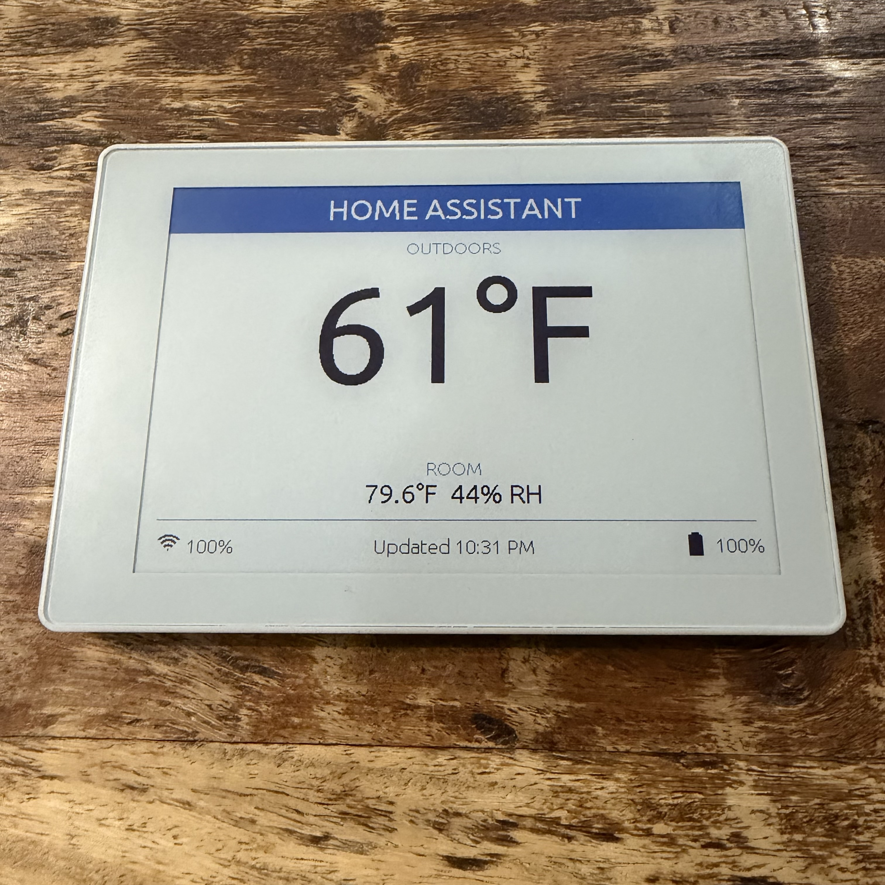
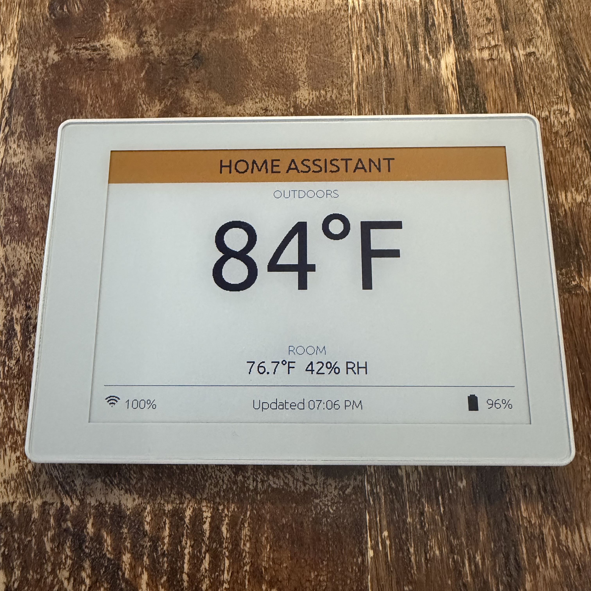
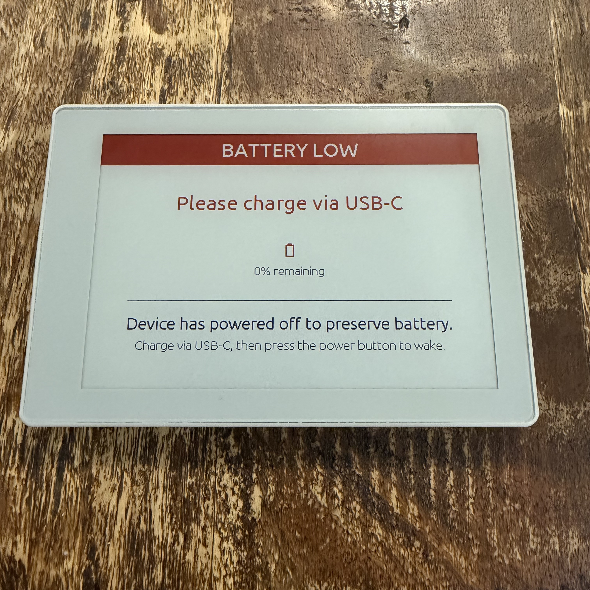
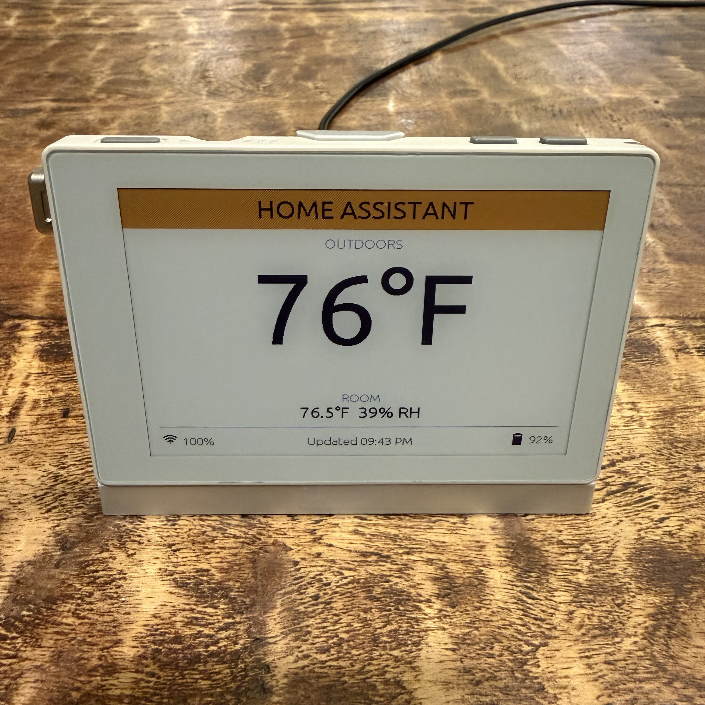
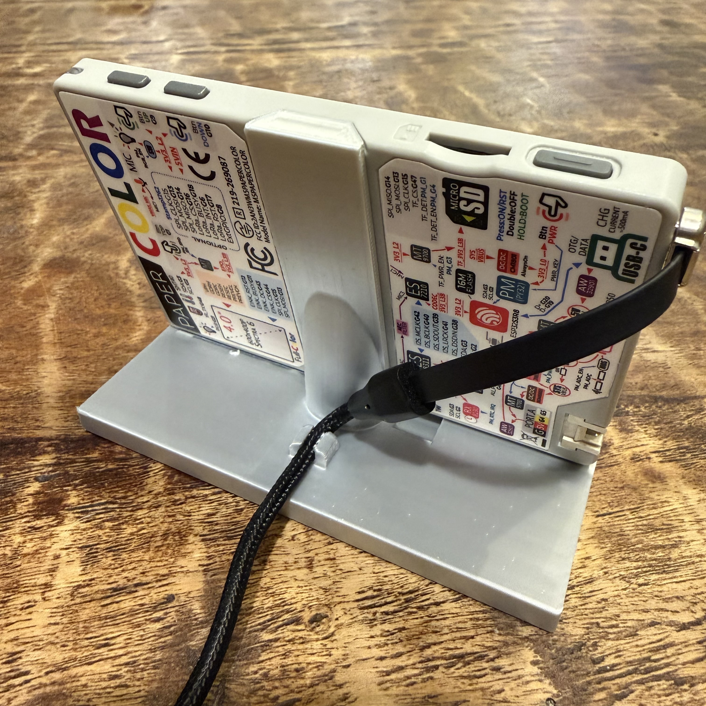

# ESPHome — M5Stack PaperColor

An ESPHome configuration for the [M5Stack PaperColor](https://docs.m5stack.com/en/core/PaperColor) (SKU: C151), a 4" E Ink Spectra 6 display device based on the ESP32-S3.

Integrates with Home Assistant to display a dashboard with outdoor temperature, room temperature/humidity, battery level, and WiFi signal strength. Designed for battery-powered use with PMIC full-shutdown sleep (~9 day projected battery life).




*Orange header rendered via 1px red/yellow checkerboard dither — Spectra E6 has no native orange channel*

---

## Hardware

| Component | Details |
|---|---|
| SoC | ESP32-S3R8 (dual-core, 240MHz) |
| Display | E Ink Spectra 6, 4", 400×600px, 6 usable colors |
| PSRAM | 8MB OPI |
| Flash | 16MB |
| Temp/Humidity | SHT40 (I2C 0x44) |
| PMIC | M5PM1 (I2C 0x6E) |
| RTC | RX8130CE (I2C 0x32) |
| Battery | 1250mAh LiPo |
| WiFi | 2.4GHz 802.11 b/g/n |

---

## Features

- **E Ink Spectra 6 display** — color-coded header with title; outdoor temp as large centered hero value (from HA); centered room temp °F / humidity (local SHT40); footer with WiFi arc + signal %, last update timestamp, and MDI battery icon + charge % — all on a shared line
- **Color-coded header** — header background changes color based on outdoor temperature: blue (≤64°F), green (≤75.5°F), orange (≤85.5°F), red (>85.5°F); header text is black on orange, white on all other colors; toggleable via HA switch (on by default). Orange is not a native Spectra E6 color — it is simulated via a 1px red/yellow checkerboard dither pattern
- **Battery icon** — black when charging or above 20%, red at ≤20%; MDI icon tracks charge level and charging state
- **PMIC full-shutdown sleep** — configurable sleep cycle (default 20 min on battery); projected **~9 day battery life** at the 20-min default. Uses M5PM1 internal wake timer (`SYS_CMD_OFF` + regs 0x38–0x3D) — cuts all power to ~92 µA standby, matching the product datasheet spec. ESP32 deep sleep was tested empirically and found ineffective (~5–10 mA sleep current regardless of sleep interval; ~1.8 day battery life). Wake is via PMIC timer (automatic) or physical power button S4.
- **USB-aware** — stays awake when USB connected; the screen refreshes every 10 minutes by default (configurable via the "On USB Refresh Interval" slider in HA)
- **Configurable intervals** — "On Battery Sleep Duration" and "On USB Refresh Interval" sliders (5–120 min, step 5) available in the HA device config; device must be awake for changes to be delivered
- **Battery monitoring** — voltage and percentage from M5PM1 PMIC via I2C; MDI icon varies by charge level and charging state; icon turns red at ≤20%. Calibrated from a measured full discharge run (Jun 2026, 43.93 hrs, 5-min intervals); piecewise lambda curve maps voltage to percentage using time-remaining fractions at each OCV threshold, rescaled so **3350 mV = 0%** (device shutdown) and **4160 mV = 100%** (resting OCV after full charge). Users see 0% when the low battery screen triggers rather than a mid-range value.
- **Low battery screen** — when battery drops below 3350 mV at wake (~5–6% of raw capacity remaining, displayed as **0%** — the curve is intentionally rescaled so users see 0% at shutdown rather than a confusing mid-range value; ~1–1.5 hrs before the discharge cliff), renders a "BATTERY LOW" warning screen with charge percentage and instructions, then issues PMIC full-shutdown with a 7-day timer. Press physical power button **S4** after charging to wake manually. If your unit dies before triggering the screen, raise the threshold toward 3450 mV in the `-200` boot sequence lambda. A **"Simulate Low Battery"** switch in the HA device config lets you trigger this screen on demand for testing — it always resets to OFF on boot so it is safe to leave in place. To test: ensure the device is on battery power (USB unplugged), wait for a normal timer wake, toggle the switch ON in HA before it shuts down, and on the next wake it will show the warning screen and issue a **7-day PMIC shutdown**. Press S4 to wake manually after testing. The switch has no effect while USB is connected.



- **Home Assistant integration** — API encrypted, OTA updates, full sensor telemetry
- **Smart boot refresh** — waits for valid sensor values before first display update; fallback refresh if HA is slow to respond
- **3 physical buttons** — A (manual refresh while awake), B (no longer wakes from PMIC shutdown — use physical power button S4 on the back for manual wake), C (spare)
- **2× RGB LEDs** — brief blue flash on every boot (all boots are cold power-on after PMIC shutdown); LEDs turn off automatically after display update or when USB is connected

---

## Key Implementation Notes

### M5PM1 PMIC Initialization
The EPD power rail is **off by default** and must be enabled at boot before the display can operate. This config uses ESPHome's I2C bus API (not Arduino `Wire`) to write the required M5PM1 registers at `on_boot` priority 800 — before the display component initializes.

The sequence also enables the boost converter (`PWR_CFG` register 0x06, bits 0 and 3), which generates the high-voltage rails (~15V+) required for e-paper pixel switching.

Register sequence derived from [M5GFX source](https://github.com/m5stack/M5GFX) and [M5Stack factory firmware HAL](https://github.com/m5stack/M5PaperColor-UserDemo).

### Spectra E6 Color Palette & Dithering
E Ink's Spectra 6 platform is marketed as "vivid full color" or "7-color," but the underlying panel exposes **6 distinct solid color channels**: black, white, red, yellow, green, and blue. The ESPHome `epaper_spi` Spectra-E6 driver faithfully implements all six — the color limitation is a panel hardware reality, not a driver gap. Orange is not one of the six native colors; any RGB value approximating orange will be quantized by the driver to either red or yellow depending on the green channel value (green > 128 → yellow, green ≤ 128 with red dominant → red).

However, additional colors can be **approximated via 1px checkerboard dithering** using `draw_pixel_at()` in the display lambda. This config uses a red+yellow 1px dither to simulate orange for the header band. At 150 PPI the dither pattern blends acceptably at normal viewing distance. This technique can extend the effective palette to approximate any color that can be blended from the six native colors — though results vary with viewing distance and color combination. Larger block sizes (2px, 4px) produce a visible checkerboard pattern and are generally not recommended.

### M5PM1 Sleep Power Optimization

This config uses **PMIC full-shutdown** (`SYS_CMD_OFF`, reg `0x0C = 0xA1`) for battery sleep. The M5PM1 internal wake timer (regs `0x38–0x3D`) is programmed with the sleep duration, then the PMIC cuts all power including the ESP32's 3V3\_L2 rail and all peripheral rails (EPD, SD, RGB LEDs, Grove). The PMIC self-wakes after the programmed interval, producing a full cold boot. This achieves the product datasheet's **92.53 µA standby** figure.

No individual rail disables are needed before shutdown — `SYS_CMD_OFF` handles everything atomically. All rails are re-enabled unconditionally at the next boot via the priority 800 sequence before the display driver initializes. The e-paper panel is bistatic — it holds its image with rails off.

**Why not ESP32 deep sleep:** Empirical discharge testing showed that ESP32 deep sleep provides essentially no power reduction on this hardware. Comparing 5-min and 30-min sleep intervals yielded only 1.11× difference in drain rate (should be ~6× if wake cycles dominated). Implied sleep current during ESP32 deep sleep is ~5–10 mA — the IT8951E EPD controller and PMIC monitoring circuits remain active regardless. Battery life with ESP32 deep sleep: ~1.8 days. With PMIC full-shutdown: projected ~9 days.

### Sleep Architecture

This config uses **PMIC full-shutdown** rather than ESP32 deep sleep. The M5PM1 has its own internal wake timer (regs `0x38–0x3D`) — no external RTC is required. After programming the timer, `SYS_CMD_OFF` (reg `0x0C = 0xA1`) cuts all power. The device cold-boots after the configured interval.

A **fail-safe readback** of reg `0x3C` after arming the timer aborts the shutdown if the arm didn't take — preventing a situation where the device powers off with no scheduled wake. A **90-second safety net** script also runs concurrently at boot: if the device is still on battery after 90 seconds (e.g. WiFi failed to connect), it issues a shutdown with a 15-minute retry timer.

`safe_mode:` is also enabled: if the device crashes repeatedly (10 failed boots), it enters a 3-minute OTA recovery window so firmware can be updated before it tries again.

### Low Battery Screen & Threshold
The low battery warning triggers at **3350 mV** (displayed as **0%** on this device's calibrated discharge curve), chosen to give approximately 1–1.5 hours of reserve above the measured discharge cliff at ~3300 mV. The calibration curve is rescaled so the shutdown threshold is 0% — users see 0% when the screen triggers rather than a confusing mid-range percentage. Below 3300 mV the discharge rate jumps from ~20–30 mV/hr to 100–200 mV/hr, so the device can die quickly once past that point. The 3350 mV threshold was calibrated from a full discharge run (Jun 2026) on a 1250 mAh cell at 20-min sleep intervals. Note that the percentage shown on the low battery screen reflects this device's specific LiPo calibration curve — the threshold mV value is what matters for tuning, not the displayed percentage.

After rendering the warning screen the device issues PMIC full-shutdown with a 7-day timer. It will not wake on a timer until those 7 days expire — press physical power button **S4** to wake manually after charging. The `Simulate Low Battery` switch in HA is safe to leave in permanently: `restore_mode: ALWAYS_OFF` means it resets to OFF on every boot regardless, so it cannot cause a boot loop. It has no effect while USB is connected.

If the device dies before showing the screen (stale display, no warning), raise the threshold to 3400–3450 mV. If it triggers too early, lower toward 3320 mV — but do not go below 3310 mV without further discharge data.

### Display BUSY Pin Polarity
The Spectra-E6 panel uses **inverted BUSY pin polarity** (HIGH = ready, LOW = busy) — opposite of the ESPHome driver default. The `busy_pin` must be configured with `inverted: true` or the display initialization hangs indefinitely. Confirmed from the Seeed reTerminal E1002 reference design (also Spectra-E6).

### I2C Pin Mapping
`SDA=GPIO3`, `SCL=GPIO2` — confirmed from M5GFX source and factory firmware `hal.h`. GPIO3 is an ESP32-S3 strapping pin; the ESPHome warning about this is expected and safe to ignore on this hardware.

### Sleep & OTA

The device sleeps for 20 minutes between refreshes by default (configurable via the "On Battery Sleep Duration" slider in HA). During PMIC full-shutdown the ESP32 is completely powerless — **Button B (GPIO9) cannot wake it**.

To perform OTA updates on battery:
1. Press the **physical power button S4** (on the back of the device, PMIC-side) to trigger a cold boot
2. The **RGB LEDs will flash blue briefly** — confirming the device is awake
3. Initiate OTA from Home Assistant within the boot window — the device stays awake while the display is refreshing (~45–80s depending on WiFi and sensor availability), then issues PMIC shutdown
4. If USB is connected, the device stays awake indefinitely — OTA can be performed at any time

If the device is stuck (boot loop or unresponsive), `safe_mode:` handles recovery automatically: after 10 failed boots it opens a 3-minute OTA window. The device can also always be flashed via USB-C as a last resort.

---

## ESPHome Requirements

- ESPHome **2026.5.3** or later (the `epaper_spi` component with `Spectra-E6` model was added in ESPHome 2026.x)
- Home Assistant with ESPHome integration

---

## Configuration

Copy `papercolor.yaml` to your ESPHome config directory (`/config/esphome/`).

Add the following entries to your `secrets.yaml`:

```yaml
papercolor_api_key: "your-32-byte-base64-key"   # generate: openssl rand -base64 32
papercolor_ota_password: "your-ota-password"
papercolor_ap_password: "your-fallback-ap-password"
wifi_ssid: "your-wifi-ssid"
wifi_password: "your-wifi-password"
```

Update `use_address` in the wifi block to match your device's IP (set a DHCP reservation in your router using your device's MAC address (visible in your router's DHCP table or in the ESPHome logs under `Local MAC`)).

Update the `ha_outdoor_temp` entity ID to match your outdoor temperature sensor in Home Assistant:
```yaml
  - platform: homeassistant
    id: ha_outdoor_temp
    entity_id: sensor.your_outdoor_temperature_entity
```

---

## First Flash

The device ships with factory firmware. First flash must be done via USB:

1. In ESPHome dashboard, add a new device and select **ESP32-S3**
2. Replace the generated stub config with `papercolor.yaml`
3. Click **Install → Plug into this computer** (USB-C cable required)
4. Select **Factory format** in the ESPHome Web installer

After first flash, all subsequent updates can be done OTA.

---

## Display Layout

```
┌─────────────────────────────────────────────────────────┐
│                  HOME ASSISTANT                          │
├─────────────────────────────────────────────────────────┤
│                    OUTDOORS                              │
│                                                          │
│                      75°F          ← large hero value   │
│                                                          │
│                                                          │
│                      ROOM                               │
│                  79.3°F  44% RH                         │
│ ─────────────────────────────────────────────────────── │
│ ))) 85%          Updated 11:06 AM            🔋 72%     │
└─────────────────────────────────────────────────────────┘
```

---

## Pin Reference

| GPIO | Function |
|---|---|
| GPIO0 | PMIC boot control (`PY_BOOT_OUT`, strapping pin) |
| GPIO1 | Button C |
| GPIO2 | I2C SCL |
| GPIO3 | I2C SDA |
| GPIO4 | Grove I |
| GPIO5 | Grove O |
| GPIO9 | Button B (spare — cannot wake from PMIC shutdown; use S4 power button) |
| GPIO10 | Button A |
| GPIO11 | EPD BUSY |
| GPIO12 | EPD RST |
| GPIO13 | SPI MOSI |
| GPIO14 | SPI MISO |
| GPIO15 | SPI CLK |
| GPIO21 | RGB LEDs (data) |
| GPIO43 | EPD DC |
| GPIO44 | EPD CS |
| GPIO45 | Audio Power Enable |
| GPIO46 | Speaker Enable |
| GPIO47 | SD Card CS |
| GPIO48 | IR TX |

---

## Display Stand

I've designed a 3D-printed display stand for the M5Stack PaperColor, which is available on MakerWorld:

**[M5Stack Paper Color e-paper Display Stand](https://makerworld.com/en/models/2921519-m5stack-paper-color-e-paper-display-stand#profileId-3269093)**

<table><tr>
<td></td>
<td></td>
</tr></table>

---

## Credits

- **[Anthropic's Claude Code](https://claude.ai/claude-code)** — this project was developed interactively with Claude Code on real hardware. The PMIC reverse-engineering, display driver research, boot sequencing, and ESPHome integration were all developed and debugged through an AI-assisted session.

- **[PFalko/m5stack-papercolor-esphome](https://github.com/PFalko/m5stack-papercolor-esphome)** — independent ESPHome implementation for the same device. Several M5PM1 PMIC improvements in this config were informed by their reverse-engineering work, specifically: the `HOLD_CFG` power-hold register sequence, enabling the 3.3V LDO rail, disabling hardware button reset functions, the 5-reading median filter for battery voltage, and the PMIC full-shutdown register sequence (regs 0x38–0x3D + `SYS_CMD_OFF`) confirming that the M5PM1 internal wake timer eliminates the need for the external RTC.

- **[M5Stack factory firmware](https://github.com/m5stack/M5PaperColor-UserDemo)** — original HAL source used to derive the M5PM1 EPD power rail init sequence.

- **[M5GFX](https://github.com/m5stack/M5GFX)** — additional PMIC register details and I2C pin mapping confirmation.

---

## Disclaimer

This project is not affiliated with or endorsed by M5Stack. Register sequences for the M5PM1 PMIC were reverse-engineered from M5Stack's open-source [M5GFX](https://github.com/m5stack/M5GFX) and [factory firmware](https://github.com/m5stack/M5PaperColor-UserDemo) — use at your own risk. This config drives a PMIC over I²C; incorrect register writes could potentially damage hardware.

This project was developed with AI assistance (Anthropic's Claude Code) and verified on a real device. It works on my unit — treat it as a starting point and review the code before flashing your own.

## License

MIT
