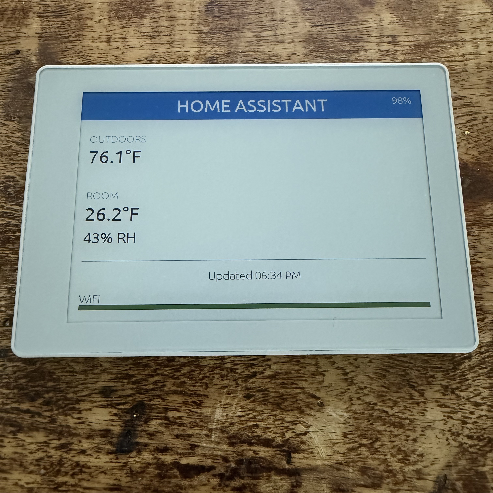

# ESPHome — M5Stack PaperColor

An ESPHome configuration for the [M5Stack PaperColor](https://docs.m5stack.com/en/core/PaperColor) (SKU: C151), a 4" E Ink Spectra 6 (7-color) display device based on the ESP32-S3.

Integrates with Home Assistant to display a dashboard with outdoor temperature, room temperature/humidity, battery level, and WiFi signal strength. Designed for battery-powered use with deep sleep.



---

## Hardware

| Component | Details |
|---|---|
| SoC | ESP32-S3R8 (dual-core, 240MHz) |
| Display | E Ink Spectra 6 (7-color), 4", 400×600px |
| PSRAM | 8MB OPI |
| Flash | 16MB |
| Temp/Humidity | SHT40 (I2C 0x44) |
| PMIC | M5PM1 (I2C 0x6E) |
| RTC | RX8130CE (I2C 0x32) |
| Battery | 1250mAh LiPo |
| WiFi | 2.4GHz 802.11 b/g/n |

---

## Features

- **7-color e-paper display** — outdoor temp (from HA), room temp/humidity (local SHT40), battery %, WiFi signal bar, last update time
- **Deep sleep** — 15-minute sleep cycle, ~5 day estimated battery life
- **Battery monitoring** — voltage and percentage read from M5PM1 PMIC via I2C
- **Home Assistant integration** — API encrypted, OTA updates, full sensor telemetry
- **Smart boot refresh** — waits for valid sensor values before updating display
- **3 physical buttons** — A (manual refresh), B (wake from sleep / OTA), C (spare)
- **2× RGB LEDs** — green flash on boot confirmation

---

## Key Implementation Notes

### M5PM1 PMIC Initialization
The EPD power rail is **off by default** and must be enabled at boot before the display can operate. This config uses ESPHome's I2C bus API (not Arduino `Wire`) to write the required M5PM1 registers at `on_boot` priority 800 — before the display component initializes.

The sequence also enables the boost converter (`PWR_CFG` register 0x06, bits 0 and 3), which generates the high-voltage rails (~15V+) required for e-paper pixel switching.

Register sequence derived from [M5GFX source](https://github.com/m5stack/M5GFX) and [M5Stack factory firmware HAL](https://github.com/m5stack/M5PaperColor-UserDemo).

### Display BUSY Pin Polarity
The Spectra-E6 panel uses **inverted BUSY pin polarity** (HIGH = ready, LOW = busy) — opposite of the ESPHome driver default. The `busy_pin` must be configured with `inverted: true` or the display initialization hangs indefinitely. Confirmed from the Seeed reTerminal E1002 reference design (also Spectra-E6).

### I2C Pin Mapping
`SDA=GPIO3`, `SCL=GPIO2` — confirmed from M5GFX source and factory firmware `hal.h`. GPIO3 is an ESP32-S3 strapping pin; the ESPHome warning about this is expected and safe to ignore on this hardware.

### Deep Sleep & OTA
The device sleeps for 15 minutes between refreshes. To perform OTA updates:
1. Press **Button B** (GPIO9) to wake the device
2. The device stays awake for **90 seconds** — initiate OTA flash within this window
3. The display auto-refreshes on every wake (no need to press Button A separately)

---

## ESPHome Requirements

- ESPHome **2026.5.2** or later (the `epaper_spi` component with `Spectra-E6` model was added in ESPHome 2026.x)
- Home Assistant with ESPHome integration

---

## Configuration

Copy `papercolor.yaml` to your ESPHome config directory (`/config/esphome/`).

Add the following entries to your `secrets.yaml`:

```yaml
papercolor_api_key: "your-32-byte-base64-key"   # generate: openssl rand -base64 32
papercolor_ota_password: "your-ota-password"
papercolor_ap_password: "your-fallback-ap-password"
wifi_ssid: "your-wifi-ssid"
wifi_password: "your-wifi-password"
```

Update `use_address` in the wifi block to match your device's IP (set a DHCP reservation in your router using your device's MAC address (visible in your router's DHCP table or in the ESPHome logs under `Local MAC`)).

Update the `ha_outdoor_temp` entity ID to match your outdoor temperature sensor in Home Assistant:
```yaml
  - platform: homeassistant
    id: ha_outdoor_temp
    entity_id: sensor.your_outdoor_temperature_entity
```

---

## First Flash

The device ships with factory firmware. First flash must be done via USB:

1. In ESPHome dashboard, add a new device and select **ESP32-S3**
2. Replace the generated stub config with `papercolor.yaml`
3. Click **Install → Plug into this computer** (USB-C cable required)
4. Select **Factory format** in the ESPHome Web installer

After first flash, all subsequent updates can be done OTA.

---

## Display Layout

```
┌─────────────────────────────────────────────────────────┐
│              HOME ASSISTANT                          91% │  ← blue header, battery %
├─────────────────────────────────────────────────────────┤
│ OUTDOORS                                                 │
│ 74.6°F                                                   │
│                                                          │
│ ROOM                                                     │
│ 25.3°F                                                   │
│ 46% RH                                                   │
│ ─────────────────────────────────────────────────────── │
│                  Updated 12:20 PM                        │
│                                                          │
│ WiFi ████████████████████░░░░░░░░░░░░░░░░░░░░░░░░░░░░░  │
└─────────────────────────────────────────────────────────┘
```

---

## Pin Reference

| Function | GPIO |
|---|---|
| I2C SDA | GPIO3 |
| I2C SCL | GPIO2 |
| SPI CLK | GPIO15 |
| SPI MOSI | GPIO13 |
| EPD CS | GPIO44 |
| EPD DC | GPIO43 |
| EPD BUSY | GPIO11 |
| EPD RST | GPIO12 |
| Button A | GPIO10 |
| Button B (wake) | GPIO9 |
| Button C | GPIO1 |
| RGB LEDs | GPIO21 |
| IR TX | GPIO48 |

---

## Credits

- **[PFalko/m5stack-papercolor-esphome](https://github.com/PFalko/m5stack-papercolor-esphome)** — independent ESPHome implementation for the same device. Several M5PM1 PMIC improvements in this config were informed by their reverse-engineering work, specifically: the `HOLD_CFG` power-hold register sequence, enabling the 3.3V LDO rail, disabling hardware button reset functions, and the 5-reading median filter for battery voltage.

- **[M5Stack factory firmware](https://github.com/m5stack/M5PaperColor-UserDemo)** — original HAL source used to derive the M5PM1 EPD power rail init sequence.

- **[M5GFX](https://github.com/m5stack/M5GFX)** — additional PMIC register details and I2C pin mapping confirmation.

---

## License

MIT
